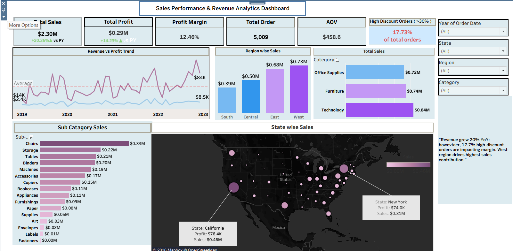

# Sales Performance & Revenue Analytics Dashboard

A KPI-driven Sales Performance and Revenue Analytics dashboard built using Tableau to help stakeholders monitor revenue growth, profit margins, and discount impact across different regions and product categories.

## Dashboard Preview

## Business Problem

Retail businesses need clear visibility into sales performance, profit trends, and discount impact to make informed pricing, inventory, and marketing decisions
